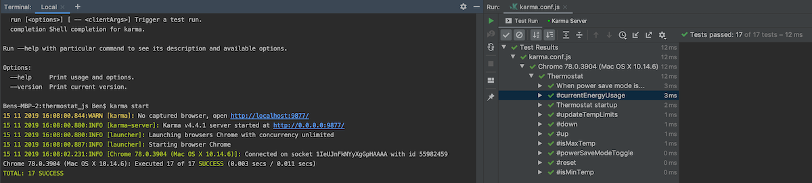

# Thermostat

A simple web web application built using JavaScript, JQuery, HTML and CSS. Built with a TDD approach, using Jasmine and Karma. 

#### Demo of application:
 

#### Jasmine test results
 

### User Requirements
- Thermostat starts at 20 degrees
- The minimum temperature is 10 degrees
- Power saving mode is on by default
- If power saving mode is on, the maximum temperature is 25 degrees
- If power saving mode is off, the maximum temperature is 32 degrees
- You can increase the temperature with an up button
- You can decrease the temperature with a down button
- You can reset the temperature to 20 with a reset button
- Current temperature turns red if high energy usage (above 25 degrees)
- Current temperature turns green if low energy usage (below 18 degrees)
- Current outdoor temperature of London is displayed (fetched from OpenWeatherMap API)

### To run

- Clone this repo
- `$ cd thermostat_js`
- `$ open index.html`

### To run test suite
- Clone this repo
- `$ cd thermostat_js`
- then either
- `$ open SpecRunner.html`
- or
- `$ npm install`
- `$ karma start`

